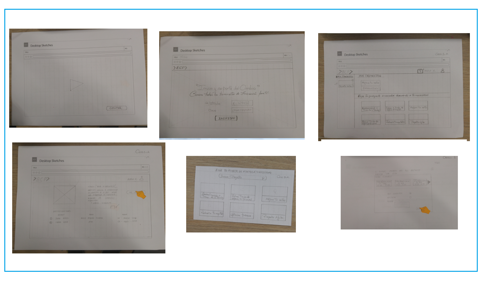

# Brief Plataforma Ecosistemas

### Datos Importantes

- El proyecto se dividio en dos grandes partes:
    * Administrador del proyecto, que es el centro de Innovación del banco de Crèdito.
    * Usuarios Internos, diferentes áreas del banco de crédito.

- La creación del prototipo se realizo de forma grupal, la documentación de la información para la creación del Readme lo realice de forma individual.

## RETO : Mostrar proyectos del area de Innovación de forma ágil a las diferentes Gerencias del BCP

El área de Innovación del BCP, busca una forma ágil de mostrar sus proyectos a las diferentes áreas del banco, motivo por el cual nos ha encomendado esta tarea, con el fin de proponer ideas innovadoras, fáciles y confiables.

## Organización de Equipo
* Nuestro objetivo:
    - Trabajo en Equipo
    - Aprendizaje conjunto
    - Roles iguales
    - Colaboración
    - Mejora continua
    - Lograr un prototipo ideal para satisfacción del usuario.

Cronograma de Actividades:
- Crear cuestionario de entrevistas.
- Proceso de entrevistas.
- Ideación de propuesta.
- Testing.
- Feedback.
- Retrospectiva.

Herramientas:
- Fotos
- Slack, WatsApp, Facebook, Search Google

Entregable:
- DEMO-MARVEL

## Manos a la obra.
Partimos de la siguientes bases:

## Proceso de Diseño

 

## Fase 1: Descubrimiento e Investigación.

### Objetivo
Analizar la información obtenida del proceso de entrevistas.

## Lista de preguntas.

## Fase 2: SINTESIS Y DEFINICIÓN

1. Affinity Mapping
-  Se realiza un findings en post it, o lluvia de ideas de acuerdo a lo obtenido en las entrevistas, dando lugar al diagrama de afinidad.

.

- Analizamos y elegimos las problemáticas que mas predominan.

Al analizar la información brindada por la Gerenta del área de Pymes y el Gerenta del àrea de ventas por internet, destaca alguna de las problemáticas.
-	Falta de organización de la información.
-	La ausencia de una plataforma que informe los proyectos del área de innovación.
-	EL 95% del tiempo, lo pasan en reuniones y solo el 5% en responder correos.
-	No puedo participar de forma activa en el cronograma de actividades del proyecto en el cual se están trabajando.
-	No tengo acceso a los datos del área del proyecto.
-	La información está dispersa.

2. User persona.

3. Content Prototype.

## Fase 3: Ideaciòn.

## Fase 4: Testing.

## Fase 5: Prototipado.

## Creativos
- marielacernap@gmail.com
- yoannahernandez.s@gmail.com
- anaisolivareshilario@gmail.com
- loayza.lourdes@gmail.com

